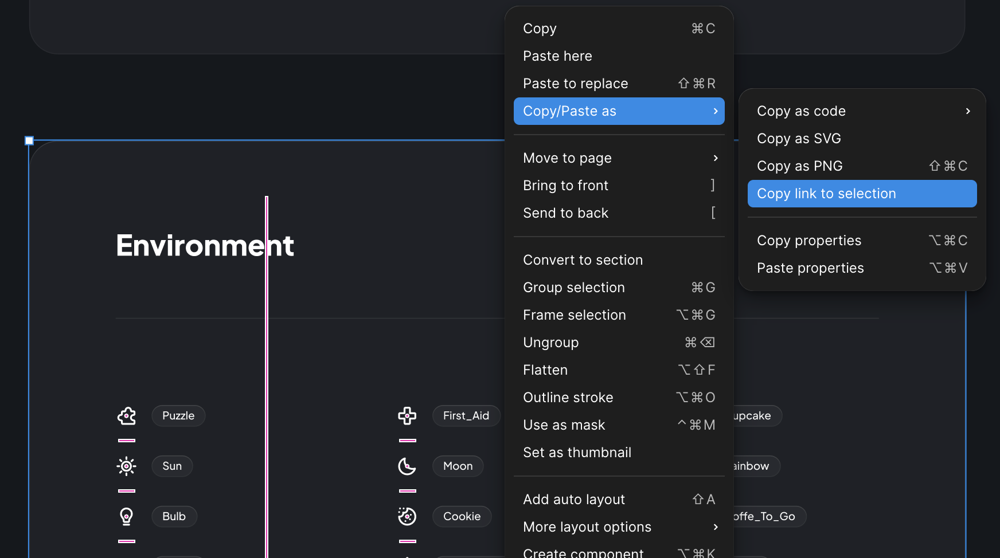
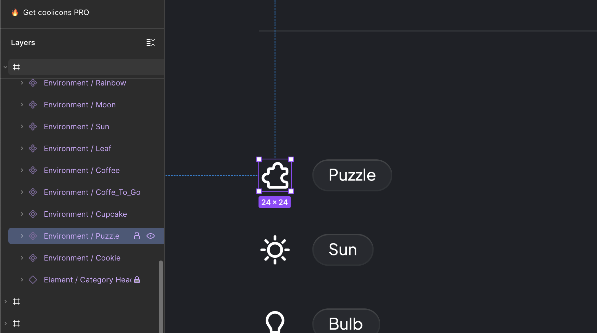

# Minimal Example

Let’s start with a quick and simple setup using a public Figma file that contains a set of icons.

We’ll use this community file as our source:
[👉 Coolicons — Free Iconset](https://www.figma.com/community/file/800815864899415771/coolicons-free-iconset)

## Preparation
### Step 1: Get the `file_key`

When you open that link in your browser, you’ll see the Figma file URL. The `file_key` is the part right after /design/:

```text
https://www.figma.com/design/MhjeA23R15tAR3PO2JamCv/coolicons-...
                             ^^^^^^^^^^^^^^^^^^^^^^ <- This is the file_key
```

### Step 2: Get a container node id

FigX needs to know where exactly to look for assets in your Figma file — that's where container node IDs come in.

To get one, simply right-click the frame or component group you're interested in, and copy its "Copy link" (selection URL).

For example, if you copy the link for a container holding a set of icons:



The URL will look something like this:

```text
https://www.figma.com/design/.../...?node-id=30788-66292
                                             ^^^^^^^^^^^ <- node id of our container
```

You can include one or more of these IDs in your `.figxconfig.toml` config to tell FigX where to fetch assets from.

### Step 3: Get a Figma Access Token
To let FigX communicate with Figma’s REST API, you need an access token.

For a quick temporary token (valid for a few hours), go here:
👉 https://www.figma.com/developers/api#access-tokens


For a permanent personal token, you can generate one in your Figma account settings:


---

## Setup

### Step 1: Create a Workspace

Now let’s set up the project.

In the root of your repository, create a `.figxconfig.toml` file:


```toml
[remotes.figma]
file_key = "MhjeA23R15tAR3PO2JamCv"      # From the URL
container_node_ids = ["30788-66292"]     # The container node ID where icons live
access_token = "..."                     # Your Figma access token
```

That’s all you need for the global config.

### Step 2: Add a Fig-file (Package Config)
Next, create a `.fig.toml` file in the same directory (we’ll treat the root as a package for now):

```toml
[svg]
puzzle = "Environment / Puzzle"
```

This tells FigX to pull a vector image named "Environment / Puzzle" from Figma, and save it locally as puzzle.svg using the svg profile.



### Step 3: Run the Import

With everything set up, run the CLI:

```bash
figx import //...
```

✅ Done!

You’ll see a new file `puzzle.svg` in your current directory, exported straight from Figma:

<center>

</center>

